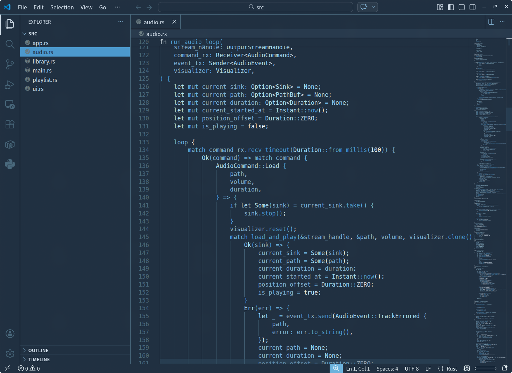

# Lumon Theme

A refined dark VS Code theme inspired by Lumon's sterile corporate aesthetic, rebuilt for real code.

Lumon Theme keeps the cold, controlled mood of the source palette while improving contrast, symbol separation, and semantic clarity for everyday development.

Designed for developers who want:
- a disciplined dark UI with low visual noise
- stronger distinction between variables, functions, properties, types, and keywords
- better readability across real projects, not just a single screenshot



## Why Lumon

Most aesthetic themes look good in a screenshot and fall apart once a project mixes languages, tooling, and semantic tokens.

Lumon Theme is tuned to stay readable in actual work:
- broad TextMate coverage for language-specific syntax
- semantic token support for symbol-aware highlighting
- balanced contrast that improves separation without turning the editor neon
- restrained UI treatment so code stays the focal point

## Included

- Dark Lumon UI theme for VS Code
- Semantic highlighting enabled by default
- Expanded syntax highlighting coverage for Rust, JavaScript, TypeScript, Python, Shell, Markdown, CSS, JSON, TOML, YAML, HTML, Lua, and diff views

## Coverage

- `391` TextMate scopes themed
- `52` semantic token selectors themed
- Semantic highlighting enabled by the theme

## Install

Install from the VS Code Marketplace, or run:

```bash
code --install-extension oldjobobo.lumon-theme
```

Then open `Preferences -> Color Theme` and select `Lumon`.

## Design Goals

Lumon Theme is not just a novelty palette port.

It is a production-focused reinterpretation of the Lumon look:
- colder and more restrained than most cinematic dark themes
- higher symbol separation than many low-contrast minimalist themes
- tuned to preserve atmosphere without sacrificing readability in long coding sessions

## Recommended Setup

For the look shown in the preview:
- semantic highlighting enabled
- bracket pair colorization on
- your preferred icon theme
- a clean mono font with good punctuation clarity

## Notes

- The theme is intentionally restrained in the UI so the editor chrome does not compete with code.
- The palette stays faithful to the Lumon mood, but the token system is tuned for stronger clarity in real projects.
